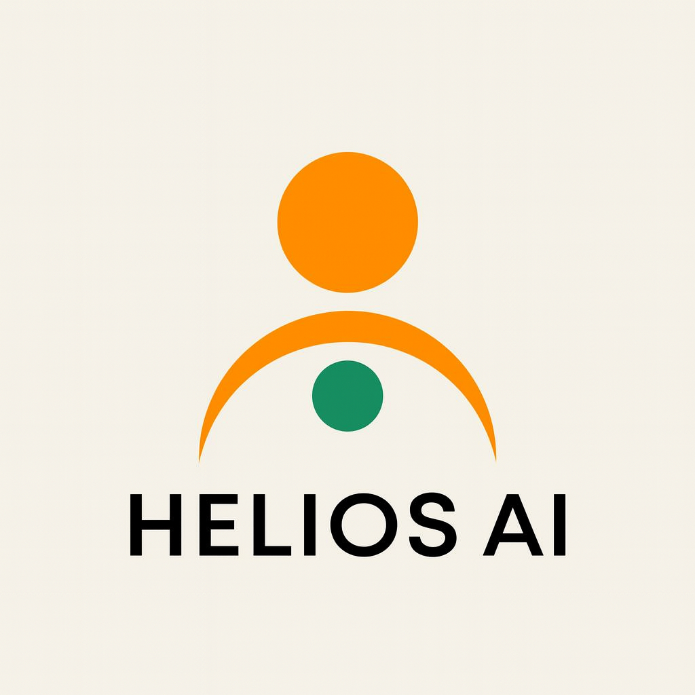
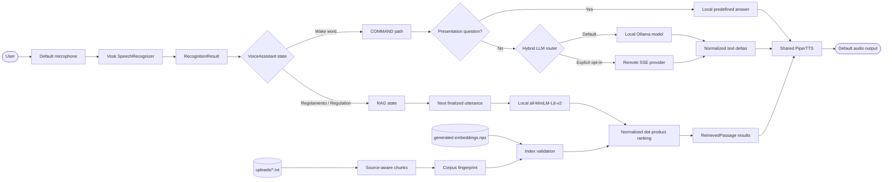
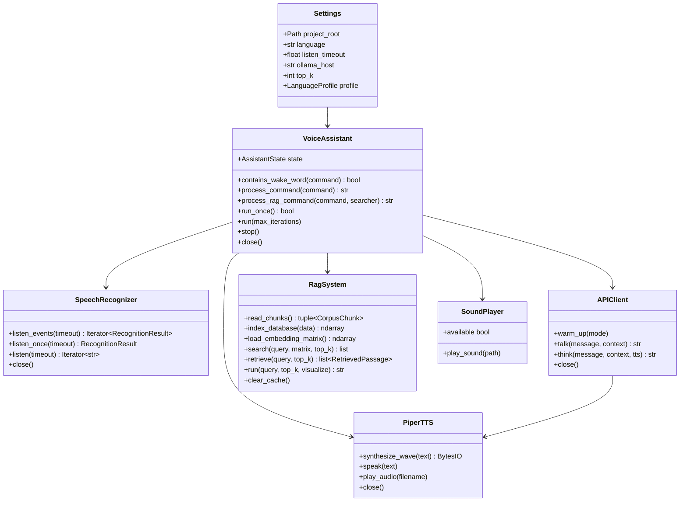
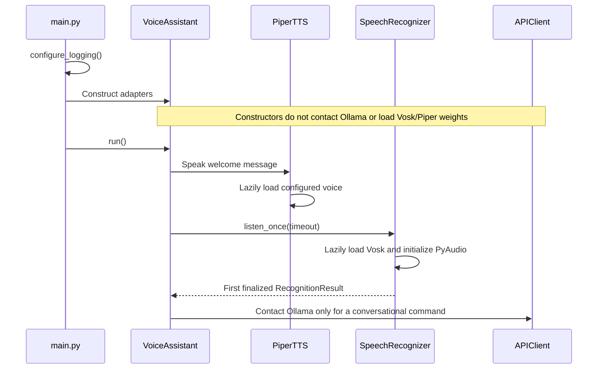
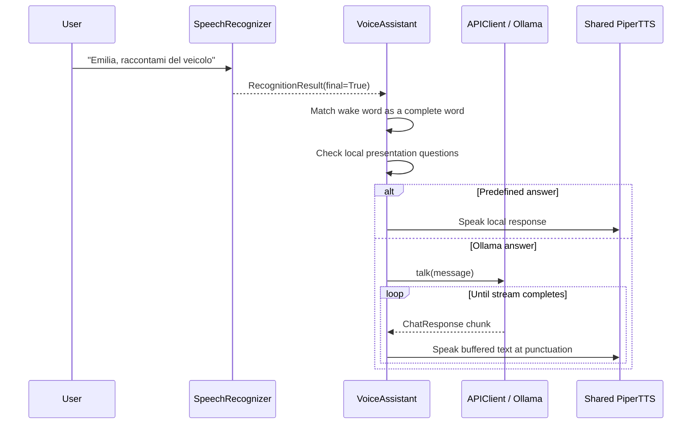
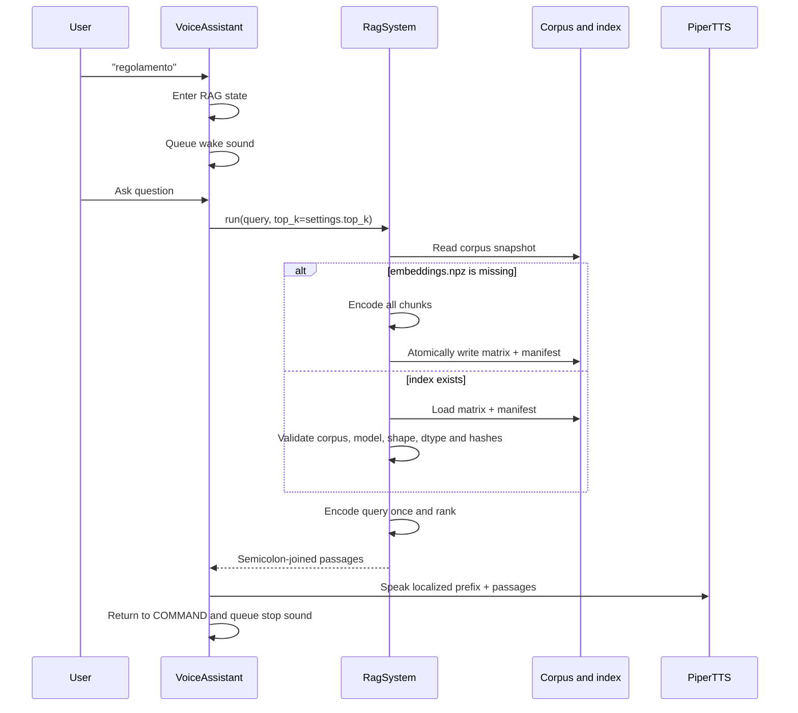

<p align="center">
  
</p>

# Helios AI

## Local voice and RAG framework for NVIDIA Jetson

Helios AI turns an edge computer into a hands-free, voice-driven assistant. A
user can speak to the system, ask a local language model a question, or search a
bundled knowledge base without needing a keyboard or display.

The project was created for **Emilia 5.9**, Onda Solare's solar vehicle, and is
primarily aimed at developers building voice interfaces for NVIDIA Jetson
devices, robots, demonstrators, and other installations where interaction must
remain simple and local. Its distinguishing feature is the combination of
offline speech recognition, local neural text-to-speech, local semantic search,
and an Ollama-hosted language model in one Python application.

Helios AI is a developer-oriented framework, not a packaged consumer
application. The repository contains the complete voice pipeline and the
knowledge files used by the Emilia deployment, but it does not implement
vehicle control, telemetry, navigation, battery management, or GPIO
integration.

> **Current implementation:** Vosk transcribes the microphone, an explicit
> state machine routes finalized utterances, a local-first hybrid LLM layer
> selects Ollama or an explicitly authorized remote SSE endpoint, a local
> SentenceTransformer retrieves regulations through an integrity-checked
> index, and a shared Piper instance speaks the result.

## Contents

- [What Helios AI does](#what-helios-ai-does)
- [Architecture](#architecture)
  - [Design and responsibilities](#design-and-responsibilities)
  - [Component interaction](#component-interaction)
- [Runtime workflows](#runtime-workflows)
  - [Startup](#startup)
  - [Conversational command](#conversational-command)
  - [RAG query](#rag-query)
  - [Shutdown](#shutdown)
- [Repository structure](#repository-structure)
- [Technology stack and dependencies](#technology-stack-and-dependencies)
- [Main components](#main-components)
- [Prerequisites](#prerequisites)
- [Installation](#installation)
- [Ollama model setup](#ollama-model-setup)
- [Configuration](#configuration)
- [Running and using the assistant](#running-and-using-the-assistant)
- [Knowledge base and embeddings](#knowledge-base-and-embeddings)
- [Asset validation and provenance](#asset-validation-and-provenance)
- [Logging and diagnostics](#logging-and-diagnostics)
- [Testing and development](#testing-and-development)
- [Performance considerations](#performance-considerations)
- [Known limitations](#known-limitations)
- [Troubleshooting](#troubleshooting)
- [FAQ](#faq)
- [Project background](#project-background)
- [License](#license)

## What Helios AI does

The default profile runs in Italian and listens through the default microphone.
Each recognition call has a maximum duration of 6.5 seconds, but it returns
earlier as soon as Vosk produces a finalized phrase.

Helios supports two user flows:

1. **Conversational command**
   - Include `emilia`, `amelia`, or `hello` as a complete word in the spoken
     phrase.
   - Helios sends the phrase to the configured Ollama chat model.
   - The streamed answer is synthesized locally with Piper as punctuation is
     received.

2. **Knowledge-base query**
   - Say `regolamento` to enter RAG mode (`regulation` in English mode).
   - Ask a question in the following finalized utterance.
   - Helios embeds the query, validates and searches the local vector index,
     selects the configured number of passages, and speaks them.

Implemented capabilities include:

- offline Italian and English speech recognition with bundled Vosk models;
- structured partial/final recognition events and first-final routing;
- consecutive-word deduplication for Vosk results;
- whole-word wake and RAG trigger detection;
- local streaming chat through the official Ollama Python client;
- optional, fail-closed remote Chat Completions SSE routing with privacy,
  health, cost, and no-replay controls;
- custom Italian and English Ollama definitions for concise responses;
- offline Italian and English Piper voices bundled as ONNX models;
- one Piper instance shared by direct and Ollama-generated responses;
- in-memory WAV synthesis that plays PCM frames without a temporary file;
- source-aware semantic retrieval with SentenceTransformers and NumPy;
- an atomic vector-index format bound to the corpus and embedding model;
- wake and completion sounds through ALSA `aplay`;
- explicit service cleanup and graceful `Ctrl+C` shutdown;
- model-free automated tests and cross-platform CI;
- asset checksum, companion-file, and provenance validation.

## Architecture



### Design and responsibilities

The application uses a small composition-root architecture:

- `main.py` configures logging and owns the top-level application lifecycle.
- `VoiceAssistant` coordinates state without implementing hardware details.
- `SpeechRecognizer` isolates PyAudio and Vosk.
- `APIClient` preserves the public model API while provider adapters, routing,
  streaming safety, privacy, health, and budget controls remain internal.
- `RagSystem` owns corpus chunking, index generation, integrity validation, and
  ranking.
- `PiperTTS` isolates voice loading, synthesis, WAV parsing, and playback.
- `SoundPlayer` delegates short cues to `aplay` with a bounded timeout.
- `Settings` and `LanguageProfile` centralize validated configuration.

Production services have defaults, but `VoiceAssistant` accepts injected
recognizer, TTS, sound, API, RAG, executor, random-choice, and sleep
implementations. This keeps the hardware path convenient while allowing the
same orchestration to be tested without opening a microphone, loading neural
models, or contacting Ollama.

Dependency direction is intentionally one-way:

```text
main.py
  `-- VoiceAssistant
      |-- SpeechRecognizer
      |-- APIClient
      |   `-- shared PiperTTS
      |-- RagSystem (created only when RAG is first used)
      `-- SoundPlayer
```

### Component interaction



## Runtime workflows

### Startup



The constructor establishes the dependency graph without performing network
requests or opening audio devices. The first welcome message loads Piper, and
the first listening cycle loads Vosk and PyAudio. The Ollama SDK client remains
lazy until a conversational request or an explicit `warm_up()` call.

The embedding model and corpus are not loaded during normal startup. RAG is
initialized only after the user enters RAG mode and asks a question.

### Conversational command



Only finalized recognition results are executed. Partial phrases are available
through `listen_events()` for other consumers, but they do not trigger commands
in `VoiceAssistant`.

Ollama transport failures are retried only while retrying is safe. Once speech
has started, a failed stream is not replayed because doing so could duplicate
audio already heard by the user. TTS failures are preserved as TTS errors
rather than being relabeled as network failures.

### RAG query



The active RAG path is extractive. It returns matching source passages directly
and does not send them to Ollama for generative synthesis. The structured
`retrieve()` API retains source filenames and scores; the compatibility
`run()` method returns plain semicolon-joined text.

### Shutdown

`Ctrl+C`, `VoiceAssistant.stop()`, context-manager exit, or the end of a bounded
test run reaches the same idempotent cleanup path:

1. stop the assistant loop;
2. wait for the single notification-sound worker;
3. close the microphone recognizer;
4. terminate owned PyAudio resources;
5. close the API/TTS adapters without closing shared instances twice;
6. mark the assistant closed so it cannot be restarted accidentally.

Each `aplay` operation has a default ten-second timeout, preventing a wedged cue
process from blocking shutdown indefinitely.

## Repository structure

```text
.
|-- main.py                         Application entry point and logging setup
|-- assistant.py                    Dependency composition and state machine
|-- config.py                       Settings, language profiles, compatibility aliases
|-- pyproject.toml                  Pytest/Ruff configuration; source-checkout contract
|-- requirements.txt                Portable desktop dependency entry point
|-- requirements-runtime.txt        Platform-neutral direct dependencies
|-- requirements-jetson.txt         Jetson-specific installation contract
|-- requirements-dev.txt            Model-free test and quality dependencies
|-- assets-manifest.json            Machine-readable asset inventory and hashes
|-- THIRD_PARTY_NOTICES.md          Provenance and redistribution gaps
|-- api/
|   |-- api_client.py               Lazy Ollama streaming client
|   |-- Modelfile-IT                Italian Emilia Ollama definition
|   `-- Modelfile-EN                English Emilia Ollama definition
|-- audio/
|   |-- tts.py                      Piper synthesis and PCM playback
|   |-- sound_player.py             Bounded ALSA cue playback
|   |-- playback.py                 Compatibility exports for historical imports
|   `-- models/                     Bundled Italian and English Piper voices
|-- document/
|   `-- rag_system.py               Chunking, indexing, validation, and retrieval
|-- models/
|   `-- all-MiniLM-L6-v2/           Bundled SentenceTransformer model
|-- recognizer/
|   |-- speech_recognizer.py        Vosk/PyAudio recognition boundary
|   `-- models/                     Bundled Italian and English Vosk models
|-- scripts/
|   |-- build_index.py              Explicit RAG index builder
|   |-- doctor.py                   Environment and asset validator
|   `-- smoke_tts.py                Side-effect-free manual TTS smoke command
|-- tests/
|   |-- test_api_client.py          Ollama streaming and retry behavior
|   |-- test_assistant.py           State routing and lifecycle behavior
|   |-- test_doctor.py              Asset validation behavior
|   |-- test_rag_system.py          Index integrity and retrieval behavior
|   |-- test_recognizer.py          Recognition result and cleanup behavior
|   `-- test_tts.py                 WAV, TTS, and cue playback behavior
|-- uploads/
|   |-- qa_pairs.txt                Question-and-answer knowledge
|   |-- regolamento.txt             Competition regulations
|   `-- team_notice.txt             Control-stop notice
|-- sounds/
|   |-- wake_up.wav                 RAG-entry cue
|   `-- stop.wav                    RAG-completion cue
|-- pictures/
|   |-- heliosAI.png                Project logo
|   `-- emilia5.9.bmp               Emilia 5.9 photograph
|-- prompts/
|   `-- update_readme.txt           Technical-writing prompt for this README
|-- .github/workflows/quality.yml   Cross-platform quality workflow
|-- .gitattributes                  Line-ending and future LFS policy
|-- .gitignore                      Generated/runtime artifact exclusions
`-- LICENSE                         MIT license
```

Generated files such as `embeddings.npz`, logs, caches, virtual environments,
and synthesized audio are intentionally ignored.

Helios currently runs from a source checkout. The bundled models, corpus, and
audio assets are not packaged into a Python wheel, so `pyproject.toml`
deliberately configures repository tools without advertising an installable
console command.

## Technology stack and dependencies

| Technology | Role in the active runtime |
|---|---|
| Python 3.10+ | Application, orchestration, adapters, scripts, and tests |
| Vosk | Offline Italian/English speech recognition |
| PyAudio / PortAudio | 16 kHz mono microphone capture |
| Ollama Python SDK | Streaming communication with a local chat model |
| Gemma 3 GGUF | Base model referenced by the included Ollama Modelfiles |
| Piper | Offline neural text-to-speech |
| ONNX Runtime | Piper inference backend |
| `sounddevice` | Playback of synthesized PCM audio |
| ALSA `aplay` | Wake and completion cue playback |
| SentenceTransformers | Local corpus and query encoding |
| PyTorch | SentenceTransformer inference backend |
| NumPy | Matrix storage, validation, normalization, and ranking |
| Pytest | Model-free unit tests |
| Ruff | Linting and formatting checks |
| GitHub Actions | Linux/Windows automated quality checks |

There is no HTTP API exposed by Helios itself. `APIClient` is an internal Python
adapter over Ollama's chat interface; the other interfaces are in-process
classes and protocols.

### Dependency files

| File | Intended use |
|---|---|
| `requirements-runtime.txt` | Dependencies that resolve consistently across desktop and Jetson |
| `requirements.txt` | Desktop install, adding generic Torch, ONNX Runtime, and Piper |
| `requirements-jetson.txt` | Shared dependencies after platform backends are provisioned |
| `requirements-remote.txt` | Optional HTTP transport for remote SSE providers |
| `requirements-dev.txt` | Model-free test and lint dependencies, including the fake-transport HTTP surface |

Jetson inference packages are deliberately not pinned to guessed public wheel
URLs. Torch and ONNX Runtime must match the exact JetPack/L4T image.

## Main components

### `main.py`

`main.py` is intentionally small:

1. configure file or stream logging from `Settings`;
2. construct `VoiceAssistant` as a context manager;
3. call `run()`;
4. return through deterministic cleanup.

The default log is `app.log` under the project root. It is opened in append mode
and library logging is not globally disabled.

### `VoiceAssistant`

`VoiceAssistant` implements two states:

- `COMMAND` accepts wake-word commands and the RAG trigger;
- `RAG` treats the next finalized utterance as a retrieval query and then always
  returns to `COMMAND`.

Its most important methods are:

- `run_once()` — consume and route at most one finalized utterance;
- `process_command()` — answer presentation questions locally or call Ollama;
- `process_rag_command()` — execute retrieval and speak the localized result;
- `run()` — speak the greeting and maintain the recoverable main loop;
- `close()` — release owned resources exactly once.

Wake words are matched as complete words, avoiding accidental activation by
larger words such as `emiliana`.

### `SpeechRecognizer`

The active recognizer:

- lazily loads the selected Vosk model;
- lazily creates the PyAudio interface;
- opens the default input as 16 kHz, 16-bit mono PCM;
- reads 4,000 frames per iteration;
- emits `RecognitionResult(text, is_final)` values;
- returns from `listen_once()` on the first final phrase;
- can retain the historical text-only `listen()` generator interface;
- stops and closes every stream in a `finally` block;
- terminates an owned PyAudio instance during `close()`.

Explicit input-device selection is not implemented.

### `APIClient`

The compatibility boundary:

- defaults to the same lazy Ollama client and model payloads;
- keeps `talk()`, `think()`, `warm_up()`, shared Piper, and idempotent cleanup;
- normalizes provider streams before sentence-level speech;
- retries or switches targets only before speech is committed;
- supports strict remote privacy authorization, health cooldowns, an expiring
  price catalog, durable budgets, and content-free metrics;
- never performs remote warm-up;
- raises sanitized `APIClientError` values after routing is exhausted.

The configured host defaults to `http://localhost:11434`.

### `RagSystem`

`RagSystem` uses the bundled `all-MiniLM-L6-v2` model:

1. read top-level `uploads/*.txt` files in deterministic filename order;
2. split each source independently at sentence boundaries;
3. retain source filename and ordinal for every chunk;
4. encode chunks in configurable batches;
5. explicitly L2-normalize every vector;
6. write an atomic compressed NPZ containing the matrix and manifest;
7. validate the complete index before searching;
8. encode each query once;
9. rank by normalized dot product with deterministic tie ordering;
10. cache the corpus and matrix for subsequent queries.

The current corpus produces 1,115 deterministic chunks. At this size a stable
full ranking is simpler and sufficiently fast; an approximate-nearest-neighbor
service is not justified without a substantially larger measured corpus.

### Audio

`PiperTTS` synthesizes into an in-memory WAV buffer, reopens the buffer with the
standard `wave` module, and passes only PCM frames plus their format metadata to
`sounddevice`. It does not write a shared `output.wav` file and does not treat
the WAV header as audio samples.

The old public name `Pyttsx3TTS` remains as an alias to `PiperTTS` for
compatibility. It does not import or use `pyttsx3`.

`SoundPlayer` resolves `aplay` only when a cue is requested. Cue playback runs
on one reusable assistant worker and has a configurable timeout.

## Prerequisites

### Hardware

- NVIDIA Jetson or another machine capable of running the selected backends;
- microphone available as the default PyAudio input;
- speaker or audio device available to `sounddevice`;
- ALSA output and `aplay` for notification cues on Linux;
- enough storage and memory for Vosk, Piper, SentenceTransformer, and Ollama
  models.

The exact production Jetson model, JetPack release, microphone, and audio-device
configuration are deployment-specific and could not be determined completely
from the current codebase.

### Software

- Python 3.10 or newer;
- a virtual environment;
- PortAudio development/runtime support for PyAudio;
- a running Ollama service;
- the configured Ollama model tags;
- platform-compatible PyTorch and ONNX Runtime builds.

## Installation

Clone the repository and enter it:

```bash
git clone https://github.com/UbiquitousDynamics/helios-ai-jetson-framework.git
cd helios-ai-jetson-framework
```

### Desktop development

Create a virtual environment:

```bash
python -m venv .venv
source .venv/bin/activate
python -m pip install --upgrade pip
```

PowerShell activation:

```powershell
python -m venv .venv
.\.venv\Scripts\Activate.ps1
python -m pip install --upgrade pip
```

Install the portable desktop dependencies:

```bash
python -m pip install -r requirements.txt
```

On Linux, PyAudio may require PortAudio headers supplied by the distribution.

### NVIDIA Jetson

Provision PyTorch and ONNX Runtime for the exact JetPack/L4T image first. Do not
allow generic pip wheels to replace working NVIDIA/vendor backends.

Verify the platform installations:

```bash
python -c "import torch, onnxruntime; print(torch.__version__, onnxruntime.__version__)"
```

The known Helios target uses `piper-phonemize-fix`. Preserve that backend and
install Piper without transitive dependency resolution:

```bash
python -m pip install piper-phonemize-fix==1.2.1
python -m pip install --no-deps piper-tts==1.2.0
python -m pip install -r requirements-jetson.txt
python -c "import piper, torch, onnxruntime; print('Jetson backends import successfully')"
```

Revalidate these versions whenever JetPack changes. The repository does not
embed a third-party wheel URL because those URLs and ABI combinations are tied
to the target image.

## Ollama model setup

The default Italian profile expects `emilia-gemma3:1b`:

```bash
ollama create emilia-gemma3:1b -f api/Modelfile-IT
```

The English profile expects `emilia-en-gemma3:1b`:

```bash
ollama create emilia-en-gemma3:1b -f api/Modelfile-EN
```

The secondary `think()` API defaults to `qwen3:0.6b`:

```bash
ollama pull qwen3:0.6b
```

Both Emilia Modelfiles derive from
`hf.co/unsloth/gemma-3-1b-it-GGUF:Q4_K_M`, request very short answers, and use a
512-token context window. Creating the models may require network access the
first time Ollama retrieves the base model.

Check the installed tags:

```bash
ollama list
```

## Configuration

Configuration is defined in [`config.py`](config.py). New code should use the
immutable `config.SETTINGS` object and its `LanguageProfile`. Historical
module-level constants remain as compatibility aliases.

### Environment variables

The two original deployment overrides remain supported:

```bash
export HELIOS_LANGUAGE=it
export HELIOS_OLLAMA_HOST=http://localhost:11434
```

PowerShell:

```powershell
$env:HELIOS_LANGUAGE = "it"
$env:HELIOS_OLLAMA_HOST = "http://localhost:11434"
```

Supported language values are `it` and `en`. Unsupported values raise
`ConfigurationError` rather than selecting an incomplete profile.

Legacy values such as `http://localhost:11434/api/generate` are accepted for the
Ollama host and normalized to the SDK base host.

Optional hybrid routing uses a versioned TOML file:

```bash
export HELIOS_LLM_CONFIG=examples/llm-routing.offline.toml
export HELIOS_LLM_REMOTE_ENABLED=false
```

Remote operation is opt-in and fails closed. The repository includes offline,
free-tier-first, paid-first, and local-first escalation examples. The committed
catalog is intentionally stale and must be replaced with reviewed current
provider data. See
[`docs/HYBRID_LLM_OPERATIONS.md`](docs/HYBRID_LLM_OPERATIONS.md) for the full
configuration, credential, privacy, budget, live-test, benchmark, rollout, and
human-review checklist.

### Active settings

| `Settings` field | Default | Runtime effect |
|---|---|---|
| `project_root` | Repository root | Anchors models, corpus, index, sounds, and logs |
| `language` | `"it"` | Selects Vosk, Piper, prompts, trigger, and chat model |
| `name` | `"emilia"` | Compatibility assistant identity |
| `listen_timeout` | `6.5` seconds | Maximum duration of one recognition call |
| `log_level` | `INFO` | Root logging level |
| `log_file_name` | `app.log` | Append-only log under the project root |
| `ollama_host` | `http://localhost:11434` | Host passed to the Ollama SDK |
| `think_model` | `qwen3:0.6b` | Model used by `APIClient.think()` |
| `top_k` | `4` | Number of RAG passages returned and spoken |

Language profiles select:

| Profile value | Italian | English |
|---|---|---|
| Vosk model | `vosk-model-small-it-0.22` | `vosk-model-small-en-us-0.15` |
| Piper voice | `it_IT-paola-medium.onnx` | `en_GB-alba-medium.onnx` |
| Ollama model | `emilia-gemma3:1b` | `emilia-en-gemma3:1b` |
| RAG trigger | `regolamento` | `regulation` |
| RAG prefix | `Ecco cosa ho trovato:` | `Here's what I found:` |

All derived paths use `project_root`; launching from another working directory
does not redirect model, corpus, sound, index, or log files.

## Running and using the assistant

From the repository root, with Ollama and the Python environment ready:

```bash
python main.py
```

Expected behavior:

1. logging is configured;
2. lightweight service adapters are constructed;
3. Piper loads and speaks the localized welcome message;
4. Vosk/PyAudio initialize on the first listening cycle;
5. the assistant waits in `COMMAND` state;
6. Ollama or RAG resources initialize only when their flow is used.

### Example: conversational answer

Say:

```text
Emilia, spiegami come funziona la tua intelligenza artificiale
```

The complete recognized phrase is passed to Ollama. The wake word is retained in
the prompt.

### Example: predefined introduction

Say:

```text
Emilia, chi sei?
```

The assistant selects one of the configured Italian introduction responses and
speaks it without contacting Ollama.

### Example: regulations search

First say:

```text
regolamento
```

After the wake cue, ask:

```text
Quanta acqua deve avere ogni occupante?
```

The top passages from the local knowledge base are spoken with the Italian RAG
prefix. The stop cue plays when the assistant returns to `COMMAND`.

The application has no spoken shutdown command. Stop it from the terminal with
`Ctrl+C`.

### Manual TTS smoke check

The smoke script has no import-time audio side effects and no artificial sleep:

```bash
python scripts/smoke_tts.py
python scripts/smoke_tts.py "Frase di prova"
```

## Knowledge base and embeddings

The active knowledge base consists of every top-level UTF-8 `.txt` file in
`uploads/`, sorted deterministically:

- `qa_pairs.txt`;
- `regolamento.txt`;
- `team_notice.txt`.

The system does not recurse into subdirectories and does not ingest PDFs.
Convert other formats to reviewed UTF-8 text before adding them.

### Index lifecycle

`embeddings.npz` is generated output and is not tracked by Git. Build it
explicitly before production deployment:

```bash
python scripts/build_index.py
```

Available overrides:

```bash
python scripts/build_index.py \
  --corpus uploads \
  --model models/all-MiniLM-L6-v2 \
  --output embeddings.npz \
  --batch-size 16 \
  --device cpu
```

If the index is missing, the first RAG query builds it automatically.
Prebuilding is recommended on constrained devices because loading the model and
encoding all chunks adds first-use latency.

### Integrity manifest

Every generated index stores both `embeddings` and a JSON manifest. Validation
binds the matrix to:

- schema version;
- splitter version;
- ordered source filenames, ordinals, and chunk text;
- corpus SHA-256;
- content-derived embedding-model identity;
- row count and vector dimension;
- NumPy dtype;
- the normalized-vector contract;
- embedding-matrix SHA-256.

The runtime rejects:

- old NPZ files without a manifest;
- a different number of rows and corpus chunks;
- content changes even when row counts remain equal;
- embedding-model content changes while allowing the repository to be relocated;
- incompatible dimensions or dtypes;
- NaN, infinite, zero, or non-unit vectors;
- a corrupted matrix checksum.

Index writes use a temporary file in the destination directory, flush and
`fsync` it, and atomically replace the target. A failed build cannot silently
leave a half-written canonical index.

### Retrieval API

```python
from document.rag_system import RagSystem

rag = RagSystem()
passages = rag.retrieve("How much water is required?", top_k=4)

for passage in passages:
    print(passage.source, passage.score, passage.text)
```

For compatibility:

```python
text = rag.run("How much water is required?", top_k=4)
```

`run()` returns a semicolon-joined string.

## Asset validation and provenance

[`assets-manifest.json`](assets-manifest.json) inventories the bundled
SentenceTransformer, Piper voices, Vosk models, corpus, cues, images, and
generated RAG index. It records:

- required or optional status;
- role;
- companion files;
- upstream information when known;
- licensing status;
- representative SHA-256 checksums.

Validate the checkout without loading a neural model or opening audio devices:

```bash
python scripts/doctor.py --assets-only --check-hashes
```

Validate installed runtime imports as well:

```bash
python scripts/doctor.py
```

Missing generated `embeddings.npz` is an expected warning before the first
build. Missing provenance or license metadata is also reported as a warning;
hash mismatches and absent required assets are errors.

See [`THIRD_PARTY_NOTICES.md`](THIRD_PARTY_NOTICES.md) before redistribution.

## Logging and diagnostics

`main.py` configures logging from `Settings`:

- default level: `INFO`;
- default file: `app.log` under the repository root;
- default mode: append;
- UTF-8 encoding;
- no module configures and truncates its own log at import time;
- logging is not globally disabled.

Recoverable API, recognition, TTS, sound, and assistant errors are logged. The
assistant resets to `COMMAND` and continues when recovery is safe.

RAG corruption and stale-index errors are intentionally explicit. They include
a rebuild instruction instead of silently returning a potentially unrelated
passage.

Provider metrics use a closed schema that has no prompt, transcript, retrieved
passage, response, header, or key field. Do not publish general application
logs if other operational queries are sensitive.

## Testing and development

### Automated coverage

The default suite is model-free and network-free. It does not require Ollama,
microphone access, Piper, Vosk, Torch, or the bundled neural models.

Covered behaviors include:

- whole-word wake detection;
- partial versus finalized recognition routing;
- `COMMAND`/`RAG` state transitions;
- configured RAG `top_k`;
- idempotent service shutdown;
- profile-specific shared TTS injection;
- Ollama host normalization and lazy construction;
- SDK `done`/`done_reason` stream parsing;
- retry success, exhaustion, and no-replay behavior;
- preservation of TTS failures;
- normalized Ollama and OpenAI-compatible SSE adapters;
- deterministic routing, privacy authorization, cooldowns, catalog freshness,
  durable budget limits, and content-free metrics;
- fallback before speech and the global no-replay rule after speech;
- PCM-frame playback without WAV-header corruption;
- lazy and bounded `aplay` execution;
- microphone stream cleanup and PyAudio termination;
- legacy RAG index rejection;
- the historical 1,116-row/1,115-chunk mismatch;
- corpus and model content fingerprints;
- vector normalization, finite-value checks, and stable ranking;
- asset paths, companion files, checksums, and manifest safety.

Install development dependencies:

```bash
python -m pip install -r requirements-dev.txt
```

Run the complete local quality suite:

```bash
python -m ruff check .
python -m ruff format --check .
python -m compileall -q main.py assistant.py config.py api audio document recognizer scripts tests
python -m pytest
python scripts/doctor.py --assets-only --check-hashes
```

### CI

`.github/workflows/quality.yml` runs on pushes, pull requests, and manual
dispatches:

- Ubuntu and Windows;
- Python 3.10 and 3.12;
- Ruff linting;
- Ruff format verification;
- bytecode compilation;
- all model-free tests;
- one asset hash-validation job.

The workflow installs `requirements-dev.txt`, not the hardware runtime stack.
Passing CI validates code and repository assets but does not prove that a
specific Jetson audio/inference image is correctly provisioned.

### Suggested development workflow

1. Create a feature branch from the latest `main`.
2. Install `requirements-dev.txt`.
3. Add or update model-free regression tests before changing behavior.
4. Make the smallest cohesive source change.
5. Run Ruff, compilation, Pytest, and the asset doctor.
6. If `uploads/*.txt` or the embedding model changed, rebuild
   `embeddings.npz`.
7. Run `scripts/smoke_tts.py` and a target-device `main.py` smoke test.
8. Inspect `git diff` and keep logs, caches, generated indexes, and environments
   untracked.
9. Commit source, tests, and documentation together when they describe one
   behavior.

## Performance considerations

### Confirmed improvements

- The corpus and compressed embedding matrix are loaded once and cached.
- Every query is encoded once.
- No startup RAG query is executed and discarded.
- No constructor sends an Ollama warm-up request by default.
- Vosk, PyAudio, the Ollama client, Piper weights, and RAG are lazy at their
  relevant boundary.
- One Piper object is shared between direct responses and streamed chat.
- Synthesis stays in memory and does not repeatedly write a fixed WAV file.
- Recognition returns on the first finalized phrase instead of always waiting
  the full timeout.
- Notification cues reuse one bounded worker instead of creating a process per
  state change.
- Index writes are atomic, and valid data is not repeatedly decompressed.

### Current algorithmic choices

- Corpus encoding uses configurable batches, defaulting to 16.
- Embeddings and queries are explicitly L2-normalized.
- Search uses an in-memory NumPy dot product.
- Stable full ranking is used instead of partial or approximate ranking.
- Model identity hashes relevant model/tokenizer content once when RAG is
  created.

With approximately 1,115 chunks, the full ranking cost is small and the simpler
algorithm improves determinism. An ANN database should be considered only after
the corpus grows enough for profiling to show a material bottleneck.

### Optimizations that still require target profiling

- CPU versus GPU placement for SentenceTransformers;
- batch-size changes on a specific Jetson memory budget;
- overlap between LLM generation and audio playback;
- audio device latency and buffer tuning;
- alternative embedding models or chunking strategies.

The repository does not claim a Jetson speedup for these changes without
target-device measurements.

## Known limitations

- The project runs from a source checkout; it is not distributed as a wheel,
  container, or appliance image.
- Only top-level UTF-8 `.txt` files are ingested into RAG.
- RAG is extractive and does not generate a source-cited answer through Ollama.
- Explicit microphone and speaker selection are not configurable through a CLI.
- Notification cues rely on Linux ALSA `aplay`.
- There is no spoken shutdown command.
- The active loop is single-session and does not expose a web or remote API.
- The first RAG build can be expensive on constrained hardware.
- Retrieval quality needs a language-specific gold-question set before changing
  the embedding model or splitter.
- CI does not exercise real microphones, audio outputs, Ollama, or neural-model
  inference.
- Existing large binary history has not been migrated to Git LFS.
- Some voice, Vosk, corpus, sound, and image provenance/license metadata remains
  incomplete.
- `think()` exists as an API capability but is not used by the active assistant
  state machine.
- The only remote vertical slice is strict OpenAI-compatible Chat Completions
  SSE. Providers with different semantics require a separately tested adapter.
- Provider accounts, current catalogs, legal/privacy approval, connectivity and
  battery signals, and target-Jetson benchmarks are deployment responsibilities.

## Troubleshooting

| Symptom | Likely cause and action |
|---|---|
| No welcome message | Verify the selected Piper `.onnx` and adjacent `.onnx.json`, `piper-tts`, ONNX Runtime, and the default output device. |
| Ollama cannot be reached | Start `ollama serve`, verify `HELIOS_OLLAMA_HOST`, and check the configured tag with `ollama list`. |
| Conversational stream stops after speaking part of an answer | Check `app.log`. The request is intentionally not replayed after speech begins. |
| Remote route always falls back locally | Check the privacy gates, connectivity state, catalog expiry, ledger permissions, budget, provider allowlist, and named credential variable. |
| Remote routing must be stopped immediately | Set `HELIOS_LLM_EMERGENCY_LOCAL_ONLY=true` and restart Helios. |
| Vosk model fails to load | Verify `HELIOS_LANGUAGE` and the corresponding bundled Vosk directory. |
| No microphone transcription | Confirm PortAudio/PyAudio and the default 16 kHz-capable input device. |
| RAG index is missing | Run `python scripts/build_index.py`, or allow the first RAG request to build it. |
| RAG reports a legacy/stale/corrupt index | Remove only generated `embeddings.npz` and rebuild it from the current corpus/model. |
| RAG returns poor matches | Verify the corpus language/content and evaluate queries against a reviewed relevance set before changing models. |
| Wake/stop cues are silent | Install ALSA utilities and run `aplay sounds/wake_up.wav`. |
| Cue playback times out | Check the ALSA device; `SoundPlayer` terminates the wait after its configured timeout. |
| Asset doctor reports a hash mismatch | Restore the expected artifact or deliberately update and review `assets-manifest.json`. |
| Asset doctor reports license warnings | Review `THIRD_PARTY_NOTICES.md`; warnings mark unresolved release metadata. |
| Jetson pip install replaces an inference backend | Reinstall the JetPack-compatible backend and follow `requirements-jetson.txt`, including Piper `--no-deps`. |
| Process continues listening | Use `Ctrl+C`; there is currently no spoken stop command. |

## FAQ

### Does Helios AI require internet access?

The active runtime is designed to operate locally when all dependencies and
models are already installed. Initial pip installation, Ollama model creation,
or retrieving missing assets may require internet access.

### Are RAG documents sent to Ollama?

No. The active RAG flow embeds and ranks text locally, then speaks the retrieved
passages directly.

### Can I add PDFs?

Not directly. Convert a PDF to reviewed UTF-8 text, place the `.txt` file in
`uploads/`, and rebuild the index.

### Can I use a different Ollama model?

Yes. Change the relevant `LanguageProfile.talk_model` or inject a `Settings`
profile that names a tag shown by `ollama list`.

### Can I use a different microphone or speaker?

The libraries currently use their default devices. The adapters are injectable,
but a user-facing device-selection option has not been implemented.

### Is CUDA used for RAG?

The default builder and assistant use CPU. `scripts/build_index.py` accepts
`--device`, but any GPU choice must match the installed Torch build and should
be validated on the target.

### Why is `embeddings.npz` not in Git?

It is reproducible generated data derived from the corpus and model. Keeping it
local prevents a stale vector file from being mistaken for source truth. Its
embedded manifest provides runtime integrity after generation.

### Why does the doctor show warnings on a clean checkout?

The generated index may not exist yet, and some third-party asset provenance is
not fully recorded. These conditions are warnings. Missing required assets or
checksum mismatches are errors.

### Is this a complete vehicle-control system?

No. The repository implements voice interaction and information retrieval only.
Vehicle actuation and telemetry are outside the current codebase.

## Project background

Helios AI was developed with
[Onda Solare](https://ondasolare.com/), the Italian solar-vehicle team. The
assistant was installed on **Emilia 5.9** in connection with the team's
participation in the 2025 Bridgestone World Solar Challenge in Australia.

<p align="center">
  
</p>

Project video:
[Surfin' the wave - Emilia 5.9](https://www.youtube.com/watch?v=8vY06AmO5Fg)

## License

Helios AI is released under the [MIT License](LICENSE), copyright 2025
Ubiquitous Dynamics.

The repository also contains third-party model and content assets. The project
license does not relicense them. Review
[`THIRD_PARTY_NOTICES.md`](THIRD_PARTY_NOTICES.md), the bundled model cards, and
the applicable upstream terms before redistribution or commercial deployment.
