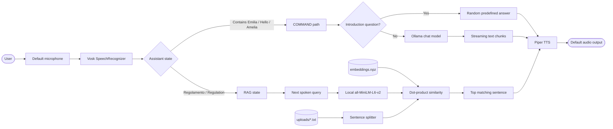
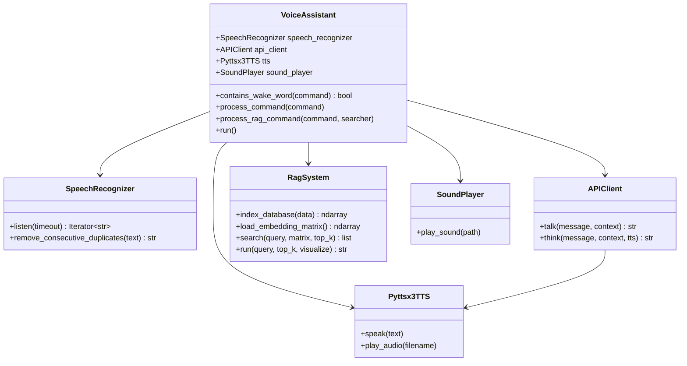
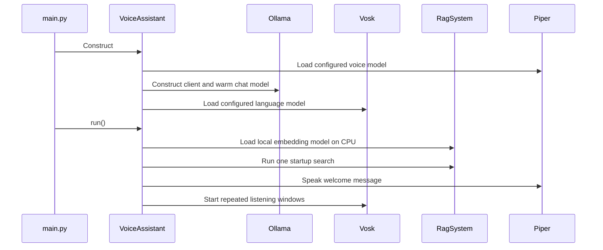
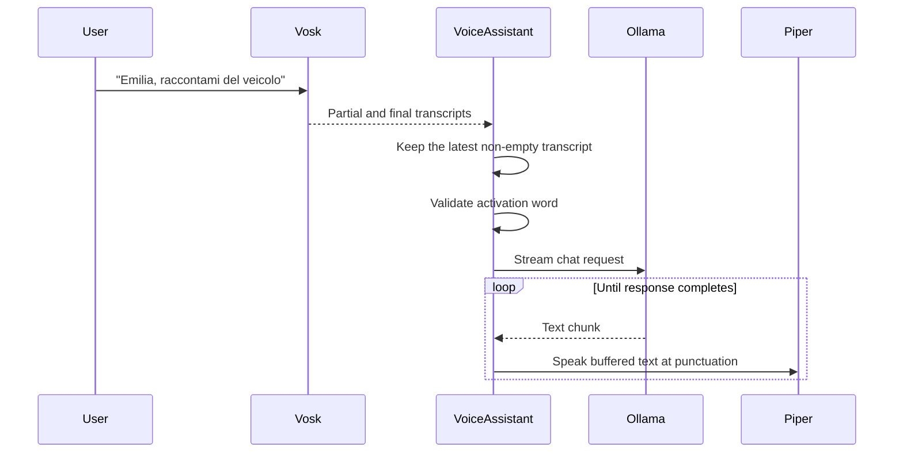
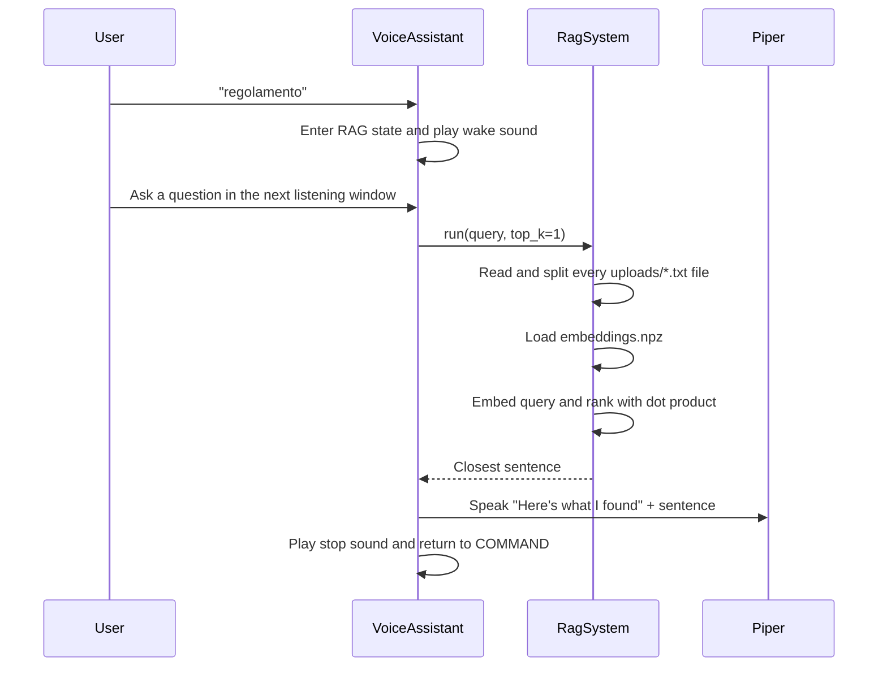

<p align="center">
  
</p>

# Helios AI

## Local voice and RAG framework for NVIDIA Jetson

Helios AI turns an edge computer into a hands-free, voice-driven assistant. A user
can speak to the system, ask a local language model a question, or search a bundled
knowledge base without needing a keyboard or display.

The project was created for **Emilia 5.9**, Onda Solare's solar vehicle, and is
primarily aimed at developers building voice interfaces for NVIDIA Jetson devices,
robots, demonstrators, and other installations where interaction must remain
simple and local. Its distinguishing feature is the combination of offline speech
recognition, local neural text-to-speech, local semantic search, and an
Ollama-hosted language model in one Python application.

Helios AI is a developer-oriented framework, not a packaged consumer application.
The current repository contains the complete voice pipeline and the knowledge
files used by the Emilia deployment, but it does not implement vehicle control,
telemetry, navigation, battery management, or GPIO integration.

> **Current implementation:** Vosk transcribes the microphone, a small state
> machine routes commands, Ollama generates conversational answers, a local
> SentenceTransformers model retrieves regulations, and Piper speaks the result.

## Contents

- [What Helios AI does](#what-helios-ai-does)
- [Architecture](#architecture)
- [Runtime workflows](#runtime-workflows)
- [Repository structure](#repository-structure)
- [Technology stack and dependencies](#technology-stack-and-dependencies)
- [Main components](#main-components)
- [Prerequisites](#prerequisites)
- [Installation](#installation)
- [Ollama model setup](#ollama-model-setup)
- [Configuration](#configuration)
- [Running and using the assistant](#running-and-using-the-assistant)
- [Knowledge base and embeddings](#knowledge-base-and-embeddings)
- [Logging and diagnostics](#logging-and-diagnostics)
- [Testing and development](#testing-and-development)
- [Performance considerations](#performance-considerations)
- [Known limitations](#known-limitations)
- [Troubleshooting](#troubleshooting)
- [FAQ](#faq)
- [Project background](#project-background)
- [License](#license)

## What Helios AI does

The default configuration runs in Italian and continuously samples the default
microphone in fixed 6.5-second windows.

It supports two user flows:

1. **Conversational command**
   - Include `emilia`, `hello`, or `amelia` in the spoken phrase.
   - Helios sends the phrase to the configured Ollama chat model.
   - The streamed answer is synthesized locally with Piper as punctuation is
     received.

2. **Knowledge-base query**
   - Say `regolamento` to enter RAG mode (`regulation` in English mode).
   - Ask a question in the following listening window.
   - Helios embeds the question, compares it with precomputed sentence embeddings,
     selects the closest sentence, and speaks it.

Implemented capabilities include:

- offline Italian and English speech recognition with bundled Vosk models;
- consecutive-word deduplication for Vosk partial and final results;
- local streaming chat through the official Ollama Python client;
- custom Italian and English Ollama model definitions for short responses;
- offline Italian and English Piper voices bundled as ONNX models;
- sentence-level semantic search with SentenceTransformers and cosine similarity;
- local, precomputed compressed embeddings for the bundled text knowledge base;
- wake and completion sounds through ALSA `aplay`;
- predefined self-introduction responses for demonstration use;
- CPU-only embedding inference for predictable behavior on low-end Jetson hardware.

The repository also contains older TF-IDF document-loading and PocketSphinx
implementations. They are available for reference but are not connected to the
current `main.py` execution path.

## Architecture



### Design and responsibilities

The code is separated into small hardware and service adapters:

- `main.py` is the process entry point.
- `VoiceAssistant` owns the interaction state and coordinates the adapters.
- `SpeechRecognizer` isolates microphone capture and Vosk transcription.
- `APIClient` isolates Ollama chat and response streaming.
- `RagSystem` owns knowledge loading, embedding generation, and similarity search.
- `Pyttsx3TTS` wraps Piper synthesis despite retaining its historical class name.
- `SoundPlayer` delegates short sound effects to ALSA.

This organization allows the recognizer, model client, retrieval strategy, or
speech backend to be replaced independently. Some older implementations remain in
the tree and have not yet been removed or adapted to the current interfaces.

### Component interaction



## Runtime workflows

### Startup



Initialization is synchronous. The application will not reach the welcome message
if the configured Ollama model, Vosk model, Piper model, local embedding model,
knowledge files, or embedding file cannot be initialized.

`APIClient` and `VoiceAssistant` each construct their own `Pyttsx3TTS` instance,
so the configured Piper model is currently loaded twice.

### Conversational command



### RAG query



The RAG path is extractive: it speaks the closest source sentence directly. It
does not send the retrieved text to Ollama for answer generation.

## Repository structure

```text
.
|-- main.py                         Primary application entry point
|-- assistant.py                    State machine and voice orchestration
|-- config.py                       Hard-coded runtime configuration
|-- requirements.txt                Python dependency list
|-- embeddings.npz                  Active compressed sentence embeddings
|-- embeddings.npy                  Older uncompressed embedding artifact
|-- api/
|   |-- api_client.py               Ollama streaming client
|   |-- Modelfile-IT                Italian Emilia Ollama definition
|   `-- Modelfile-EN                English Emilia Ollama definition
|-- audio/
|   |-- tts.py                      Active Piper speech synthesis
|   |-- sound_player.py             Active ALSA sound-effect playback
|   |-- playback.py                 Standalone/duplicate TTS smoke script
|   `-- models/                     Bundled Italian and English Piper models
|-- document/
|   |-- rag_system.py               Active semantic retrieval implementation
|   |-- document_loader.py          Legacy PDF/TXT loader
|   |-- document_retriever.py       Legacy TF-IDF retriever
|   |-- model_download.py           SentenceTransformer download utility
|   |-- rag_system_copy.py          Older experimental RAG implementation
|   `-- bozzaComandi.txt            Development notes/command draft
|-- models/
|   `-- all-MiniLM-L6-v2/           Bundled local SentenceTransformer model
|-- recognizer/
|   |-- speech_recognizer.py        Active Vosk/PyAudio recognizer
|   |-- speech_recognizer_pocketsphinx.py
|   |                                Inactive English PocketSphinx alternative
|   `-- models/                     Bundled Vosk and PocketSphinx assets
|-- uploads/
|   |-- qa_pairs.txt                Question-and-answer knowledge
|   |-- regolamento.txt             Competition regulations
|   `-- team_notice.txt             Control-stop notice
|-- sounds/                         Wake and completion WAV files
|-- pictures/                       Project logo and Emilia photograph
|-- prompts/update_readme.txt        Historical documentation prompt
|-- main_video.py                   Manual Piper demonstration script
|-- main_sim.py                     Outdated diagnostic script
|-- test_rag_system_import.py        Outdated import diagnostic script
|-- assistant.bk                    Historical assistant backup
|-- main.py.save                    Historical main backup
|-- requirements_backup.txt         Historical dependency snapshot
|-- .github/workflows/pylint.yml    Push-triggered Pylint workflow
`-- LICENSE                         MIT license
```

An empty tracked file named `ollama_RAG_integration` also exists at the repository
root. It is not imported or used by the application.

### Active versus legacy modules

| Area | Active implementation | Present but inactive |
|---|---|---|
| Speech recognition | `recognizer/speech_recognizer.py` (Vosk) | PocketSphinx recognizer |
| Retrieval | `document/rag_system.py` (dense embeddings) | `DocumentLoader` + TF-IDF `DocumentRetriever` |
| Speech synthesis | `audio/tts.py` (Piper) | Historical class name and unused TTS packages |
| Application entry | `main.py` + `assistant.py` | `main.py.save`, `assistant.bk`, `main_sim.py` |
| Embeddings | `embeddings.npz` | `embeddings.npy` |

## Technology stack and dependencies

| Technology | Role in the active runtime |
|---|---|
| Python | Application, orchestration, state machine, and adapters |
| Vosk | Offline Italian/English speech recognition |
| PyAudio / PortAudio | 16 kHz microphone capture |
| Ollama Python SDK | Streaming communication with the local chat model |
| Gemma 3 GGUF | Base conversational model referenced by the Ollama Modelfiles |
| Piper | Offline neural text-to-speech |
| ONNX Runtime | Execution backend required by the Piper voice models |
| `sounddevice` | Playback of synthesized Piper audio |
| ALSA `aplay` | Playback of wake and completion sounds |
| SentenceTransformers | Local sentence and query encoding |
| PyTorch | SentenceTransformer execution on CPU |
| NumPy | Embedding persistence and dot-product similarity search |
| Tenacity | Retry decoration around Ollama client methods |

The active source imports `numpy` and `sounddevice`, but they are not declared
directly in `requirements.txt`; installation currently relies on them arriving as
transitive dependencies. They should be pinned explicitly for reproducible
environments.

Several declared packages support legacy or experimental files rather than the
primary runtime:

| Dependency | Current use |
|---|---|
| `pdfplumber`, `scikit-learn` | Legacy PDF/TXT loader and TF-IDF retriever |
| `pocketsphinx` | Inactive alternative recognizer |
| `requests` | Imported by `APIClient` but not used by its Ollama SDK path |
| `pyttsx3`, `gTTS`, `pygame` | Historical audio implementations; inactive |
| `SpeechRecognition` | No longer imported by the active assistant |
| `openai-whisper` | Declared but not used in tracked Python code |
| `torchvision`, `torchaudio`, `matplotlib` | Not required by the active entry path |

There is no HTTP API exposed by Helios AI itself. `APIClient` is an internal
adapter over Ollama's chat interface; all other component APIs are Python class
methods used in-process.

## Main components

### `main.py`

`main.py` disables logging at `CRITICAL` level, constructs a
`multiprocessing.Manager`, creates `VoiceAssistant`, and calls `run()`.

It still defines a `load_documents()` helper and creates a shared dictionary, but
the process that would call this helper is commented out. The active RAG system
loads text from `uploads/` directly.

### `VoiceAssistant`

`VoiceAssistant` implements the `COMMAND` and `RAG` states:

- `COMMAND` accepts phrases containing the activation words and routes normal
  questions to Ollama.
- `RAG` consumes the next listening window as a semantic-search query and then
  returns to `COMMAND`.
- `IDLE` is declared in `AssistantState` but is never entered.

Self-introduction questions are detected through language-specific substring
checks and answered with one of three predefined phrases.

### `SpeechRecognizer`

The active recognizer:

- loads the Vosk model selected by `config.LANGUAGE`;
- opens the default PyAudio input as 16 kHz, 16-bit mono PCM;
- reads 4,000 frames per iteration;
- yields changing partial results and accepted final results;
- removes immediately repeated words;
- stops after `LISTEN_TIMEOUT`.

Because the method is a generator, `VoiceAssistant` iterates over all yielded
transcripts and keeps the latest non-empty value.

### `APIClient`

The Ollama adapter uses `ollama.Client().chat()`:

- a non-streaming empty chat warms the conversational model during construction;
- `talk()` streams the response and sends buffered segments to Piper when a
  punctuation character is observed;
- `think()` targets the secondary model, but the active assistant never calls it;
- optional context is represented as a system message.

The constructor accepts `api_url`, but the value is not passed to `Client` and is
not otherwise used. Connection behavior therefore follows the Ollama SDK default
(normally the local Ollama service), not `config.OLLAMA_API_URL`.

### `RagSystem`

`RagSystem` uses a bundled `all-MiniLM-L6-v2` SentenceTransformer:

1. concatenate all top-level `uploads/*.txt` files in sorted filename order;
2. split the combined text at whitespace following `.`, `!`, or `?`;
3. encode sentences in batches of 16 and normalize the vectors;
4. save them as compressed `embeddings.npz` when indexing;
5. encode and normalize each query;
6. calculate cosine-equivalent scores with a NumPy dot product;
7. return the top matching source sentence or sentences.

Inference is explicitly forced to CPU, even when CUDA is available.

### Audio

`Pyttsx3TTS` loads the configured Piper ONNX voice, writes each synthesized
utterance to the fixed file `output.wav`, and plays it through `sounddevice`.
`output.wav` is ignored by Git.

`SoundPlayer` checks for `aplay` at module import and invokes it in a child process
for wake and completion WAV files.

## Prerequisites

### Hardware

- NVIDIA Jetson or another Linux system capable of running the dependencies;
- microphone exposed as the default PyAudio input;
- speaker or audio device exposed as the default `sounddevice`/ALSA output;
- enough storage and memory for the bundled speech, embedding, TTS, and Ollama
  models.

The exact tested Jetson model, JetPack release, CUDA release, microphone, and
audio-device configuration could not be determined from the current codebase.

### Software

- **Python 3.10 is recommended.** The active code uses Python 3.10 union-type
  syntax (`list[str] | None`). Python 3.8 and 3.9 cannot parse it.
- a working Python virtual environment and compiler/toolchain for native packages;
- PortAudio development/runtime support for PyAudio;
- ALSA and the `aplay` command for sound effects;
- a running Ollama service with the selected Emilia model;
- platform-compatible PyTorch and ONNX Runtime builds.

`requirements.txt` mixes generic packages with a Linux AArch64 Vosk wheel, a CUDA
11.8 PyTorch index, and `torch==1.13.0`. It is tailored toward an ARM/Linux
deployment and may require adjustment for a specific JetPack release. It is not a
portable lock file for Windows, macOS, x86 Linux, or every Jetson image.

## Installation

Clone the repository and enter it:

```bash
git clone https://github.com/UbiquitousDynamics/helios-ai-jetson-framework.git
cd helios-ai-jetson-framework
```

Create a Python 3.10 virtual environment:

```bash
python3.10 -m venv .venv
source .venv/bin/activate
python -m pip install --upgrade pip
```

Install the dependencies:

```bash
python -m pip install --no-cache-dir -r requirements.txt
```

Before using this command on a different platform, review these entries in
`requirements.txt`:

```text
--find-links https://download.pytorch.org/whl/cu118
torch==1.13.0
https://github.com/alphacep/vosk-api/.../vosk-0.3.30-py3-none-linux_aarch64.whl
```

Choose PyTorch, ONNX Runtime, PyAudio, and Vosk builds supported by the actual
host. Exact alternative package versions could not be determined from the
current codebase.

There is no Python package build, Docker image, installer, or generated
application artifact. Running the source tree is the deployment model.

## Ollama model setup

The default Italian configuration expects `emilia-gemma3:1b`. Create it from the
included Modelfile:

```bash
ollama create emilia-gemma3:1b -f api/Modelfile-IT
```

For English mode, create the model configured as `emilia-en-gemma3:1b`:

```bash
ollama create emilia-en-gemma3:1b -f api/Modelfile-EN
```

Both definitions derive from
`hf.co/unsloth/gemma-3-1b-it-GGUF:Q4_K_M`, request very short answers, and use a
512-token context window. Creating them may require network access the first time
Ollama obtains the base model.

Check that Ollama can see the result:

```bash
ollama list
```

The application constructs a default `ollama.Client()` and immediately warms the
selected model. Start or configure Ollama before launching `main.py`.

## Configuration

Configuration is implemented as Python constants in [`config.py`](config.py).
There is no CLI parser, `.env` loader, or environment-variable mapping in this
repository. Edit the file and restart the process.

### Active settings

| Setting | Default | Runtime effect |
|---|---|---|
| `LANGUAGE` | `"it"` | Selects Italian/English Vosk, Piper, prompts, RAG trigger, and chat model. |
| `WAKE_WORD` | `"emilia"` | Primary conversational activation substring. |
| `RAG_WORD` | `"regolamento"` in Italian | Substring that switches `COMMAND` to `RAG`. |
| `LISTEN_TIMEOUT` | `6.5` seconds | Duration of each microphone listening window. |
| `WAKE_SOUND` | `sounds/wake_up.wav` | Played when entering RAG mode. |
| `STOP_SOUND` | `sounds/stop.wav` | Played after a RAG response. |
| `VOSK_MODEL_PATH` | Italian model path | Model loaded by Vosk. |
| `TTS_MODEL` | Italian Paola ONNX model | Voice loaded by Piper. |
| `MODEL_TALK` | `emilia-gemma3:1b` in Italian | Ollama model used by `talk()`. |
| `PRES_Q_1..3` | Language-specific phrases | Substrings identifying self-introduction questions. |
| `PRES_A_1..3` | Language-specific phrases | Random canned self-introduction answers. |

`uploads`, `embeddings.npz`, and `./models/all-MiniLM-L6-v2` are passed directly
inside `VoiceAssistant.run()` rather than being fully controlled by configuration.

### Defined but inactive or partially active settings

| Setting | Status |
|---|---|
| `LOG_LEVEL`, `LOG_FORMAT`, `LOG_FILE` | Defined, but `main.py` disables logging directly and does not configure these values. |
| `NAME` | Defined but not used in the active welcome message or routing. |
| `VOICE` | Set by language but not used by Piper. |
| `TTS_FOLDER` | Defined but unused by the current TTS implementation. |
| `TIMEOUT_SOUND` | Defined but no timeout sound is played in the current state loop. |
| `UPLOAD_FOLDER`, `ALLOWED_EXTENSIONS` | Used only by the inactive `DocumentLoader` path. |
| `MODEL_THINK` | Loaded into `APIClient.models`; `think()` is not called by the active assistant. |
| `OLLAMA_API_URL` | Passed into `APIClient.__init__` but ignored when constructing the Ollama client. |
| `QA_JSON_PATH`, `TOP_K`, `EMBEDDING_MODEL` | Defined but unused by the active RAG implementation. |

### Switching to English

Edit:

```python
LANGUAGE = "en"
```

The language branch then selects:

- `recognizer/models/vosk-model-small-en-us-0.15`;
- `audio/models/en_GB-alba-medium.onnx`;
- `emilia-en-gemma3:1b`;
- `regulation` as the RAG trigger.

Restart the application after the change.

## Running and using the assistant

From the repository root, with Ollama running and the Python environment active:

```bash
python main.py
```

Expected behavior:

1. the application loads two Piper instances, warms the Ollama model, loads Vosk,
   and initializes the local SentenceTransformer;
2. it performs a startup RAG search for `"How many liters of water?"` and discards
   the returned text;
3. it speaks an Italian or English welcome message;
4. it continuously listens in `COMMAND` state.

Logging is disabled by `main.py`, so successful startup does not produce a useful
console trace by default.

### Example: conversational answer

Say:

```text
Emilia, spiegami come funziona la tua intelligenza artificiale
```

The activation substring is required. The complete recognized phrase, including
`Emilia`, is passed to Ollama.

### Example: predefined introduction

Say:

```text
Emilia, chi sei?
```

The assistant selects one of the configured Italian introduction responses
without contacting Ollama for that answer.

### Example: regulations search

First say:

```text
regolamento
```

After the wake sound, ask:

```text
Quanta acqua deve avere ogni occupante?
```

The closest sentence from the bundled text files is spoken, prefixed with the
English phrase `"Here's what I found:"`.

The current application has no spoken shutdown command. Stop it from the terminal
with `Ctrl+C`.

## Knowledge base and embeddings

The active knowledge base is every top-level `.txt` file in `uploads/`, sorted by
filename:

- `qa_pairs.txt`;
- `regolamento.txt`;
- `team_notice.txt`.

`RagSystem` does not recurse into directories and does not read PDF files. The
legacy `DocumentLoader` supports PDFs, but it is not used by `main.py`.

### Rebuilding embeddings

Rebuild `embeddings.npz` whenever a text file is added, removed, renamed, or
edited:

```bash
python -c "from document.rag_system import RagSystem; RagSystem(reindex=True).run('index check', top_k=1)"
```

Run the command from the repository root. It loads the bundled model on CPU,
regenerates all sentence vectors, writes `embeddings.npz`, and performs a final
test search.

The embedding file stores vectors only. It does not store the source sentences,
filenames, checksums, or model identifier. At runtime the code checks vector
dimension compatibility but does not verify that:

- the number of embeddings equals the number of current sentences;
- file order and content still match the indexed data;
- the same model produced the file.

Keeping the text files and embedding file synchronized is therefore a manual
requirement.

`embeddings.npy` is an older artifact and is not loaded by the active code.

## Logging and diagnostics

`document/rag_system.py` configures both console logging and a fresh
`rag_debug.log` file at import time. Shortly afterward, `main.py` calls:

```python
logging.disable(logging.CRITICAL)
```

This suppresses application logs at runtime, regardless of `LOG_LEVEL` in
`config.py`. To diagnose startup or runtime problems, temporarily remove or
comment out that line and configure logging explicitly.

Be aware that debug logging in `APIClient` includes complete chat messages and
individual model chunks. RAG logging includes the query. Do not enable or publish
debug logs when prompts or knowledge files contain sensitive information.

Errors inside the main assistant loop are caught and followed by a one-second
delay. TTS and sound errors are also caught and only logged; when logging is
disabled, audio failures may therefore appear silent.

## Testing and development

### Current automated coverage

There is no maintained unit or integration test suite and no `pytest`
configuration.

The GitHub Actions workflow runs Pylint on pushes across Ubuntu and Windows with
Python 3.8-3.11. It installs Pylint only, not the project dependencies. The matrix
does not prove runtime compatibility; in particular, the active Python 3.10 type
syntax is incompatible with Python 3.8 and 3.9.

### Static checks

Compile all Python sources:

```bash
python -m compileall -q .
```

Run the same style of lint check used by CI:

```bash
python -m pip install pylint
pylint $(git ls-files '*.py')
```

On PowerShell:

```powershell
pylint (git ls-files '*.py')
```

### Manual checks

Test the Piper welcome message:

```bash
python main_video.py
```

This script speaks a fixed English sentence and then sleeps for 60 seconds.

Perform a full smoke test by running `python main.py` with:

- Ollama and the configured chat model available;
- a working microphone and audio output;
- all bundled models readable;
- knowledge text and embeddings synchronized.

Then exercise both a conversational command and a RAG query.

### Suggested development workflow

1. Create a feature branch from the latest `main`.
2. Make source and configuration changes in the repository root.
3. If any `uploads/*.txt` content changed, rebuild and review
   `embeddings.npz`.
4. Run the static checks above.
5. Run the Piper smoke check and a hardware-assisted `main.py` smoke test.
6. Inspect `git diff` and ensure generated `output.wav`, logs, virtual
   environments, and caches remain untracked.
7. Commit the source change together with any intentionally regenerated
   embedding artifact.

### Outdated diagnostic scripts

`main_sim.py` and `test_rag_system_import.py` describe older interfaces. For
example, they pass the removed `documents` argument to `VoiceAssistant` or the
removed `txt_file` argument to `RagSystem`. They should not be treated as passing
tests for the current code.

## Performance considerations

- SentenceTransformer inference is forced to CPU for stability on Jetson Nano.
- Knowledge embeddings are normalized and compressed to reduce search work and
  storage.
- Reindexing uses batches of 16 and periodic garbage collection.
- Query ranking is an in-memory NumPy dot product over every sentence.
- All knowledge files are reread and sentence-split for every RAG query.
- Ollama response text is streamed so speech can begin before generation
  completes.
- The Piper voice is currently loaded twice at startup.
- Each synthesized segment overwrites `output.wav`.
- A new process is created for every wake/completion sound.

For a larger knowledge base, store sentence metadata with the embeddings, load
the corpus once, validate row counts, and consider an approximate nearest-neighbor
index. For lower startup memory, share one Piper instance between
`VoiceAssistant` and `APIClient`.

## Known limitations

- There is no command-line interface, GUI, web API, packaging metadata, or Docker
  deployment.
- Configuration is hard-coded in Python.
- `IDLE` state exists but is unused; microphone windows run continuously.
- Activation and RAG triggers use substring matching and may activate
  unintentionally.
- The latest Vosk partial result can replace an earlier accepted final result.
- The PyAudio object is never explicitly terminated during shutdown.
- RAG returns matching sentences rather than a generated, source-cited answer.
- The RAG prefix remains English even in Italian mode.
- Embedding/source alignment is not validated.
- The configured Ollama URL is not applied to the SDK client.
- `talk()` catches exceptions internally, so its Tenacity decorator cannot retry
  those failures.
- The Ollama warm-up request is not protected by the `talk()` error handling.
- Audio output uses a fixed temporary filename and is not safe for concurrent
  synthesis.
- `audio/tts.py` reads the complete WAV file as raw `int16` data, including its
  header, rather than reading WAV frames through the `wave` module.
- Logging settings in `config.py` are not honored by `main.py`.
- Several dependencies and backup modules are no longer part of the active path.
- There is no maintained automated test coverage or graceful shutdown procedure.

## Troubleshooting

| Symptom | Likely cause and action |
|---|---|
| Startup stops before the greeting | Confirm Ollama is running and `MODEL_TALK` exists. The constructor sends a warm-up chat immediately. |
| `FileNotFoundError` for the embedding model | Run from the repository root and verify `models/all-MiniLM-L6-v2/model.safetensors` exists. |
| `FileNotFoundError` for `uploads` or no text files | Keep at least one top-level `.txt` file in `uploads/`. |
| RAG answer does not match the source | Rebuild `embeddings.npz` after every knowledge-file change. |
| Vosk model fails to load | Verify `LANGUAGE` and the selected `VOSK_MODEL_PATH`. |
| No microphone transcription | Check the default PortAudio input and 16 kHz mono support. Device selection is not configurable in code. |
| No Piper speech | Verify the selected `.onnx` and adjacent `.onnx.json` files, plus the default `sounddevice` output. |
| Wake/stop sounds are silent | Install/check ALSA `aplay` and verify the WAV paths in `config.py`. |
| No useful error appears | Re-enable logging in `main.py`; several subsystems catch and log failures without raising them. |
| `pip install` rejects a wheel | The requirements include a Linux AArch64 Vosk wheel and CUDA-specific PyTorch source. Select builds compatible with the host. |
| English mode cannot chat | Create `emilia-en-gemma3:1b` from `api/Modelfile-EN` or change `MODEL_TALK` to an installed Ollama model. |
| Process does not stop after speech | The application has an infinite state loop. Use `Ctrl+C`; there is no spoken stop command. |

## FAQ

### Does Helios AI require internet access?

The runtime components are intended to run locally: Vosk, SentenceTransformers,
Piper, and the default Ollama client. Initial dependency installation and model
creation may require internet access. Remote Ollama behavior depends on the SDK
environment and deployment configuration.

### Are documents sent to the language model?

Not in the active RAG flow. The semantic search is local and its closest sentence
is spoken directly. The inactive `DocumentRetriever` code previously supported
adding document text as model context.

### Can I add PDFs?

Not to the active RAG pipeline. Convert them to UTF-8 text and place the `.txt`
file in `uploads/`, then rebuild `embeddings.npz`. PDF extraction exists only in
the inactive `DocumentLoader`.

### Can I use a different Ollama model?

Yes. Change `MODEL_TALK` in `config.py` to the name reported by `ollama list`.
The active assistant does not use `MODEL_THINK`.

### Can I use a different microphone or speaker?

The current code always uses the default PyAudio and `sounddevice` devices.
Explicit device selection is not implemented.

### Is CUDA used for RAG?

No. `RagSystem` explicitly selects `device='cpu'`, even if PyTorch reports CUDA
as available.

### Is this a complete vehicle-control system?

No. The repository implements voice interaction and information retrieval only.
Vehicle hardware control and telemetry could not be determined from the current
codebase because they are not implemented here.

## Project background

Helios AI was developed with
[Onda Solare](https://ondasolare.com/), the Italian solar-vehicle team. The
assistant was installed on **Emilia 5.9** in connection with the team's
participation in the 2025 Bridgestone World Solar Challenge in Australia.

<p align="center">
  
</p>

Project video: [Surfin' the wave - Emilia 5.9](https://www.youtube.com/watch?v=8vY06AmO5Fg)

## License

Helios AI is released under the [MIT License](LICENSE), copyright 2025
Ubiquitous Dynamics.

The repository also contains third-party model assets. Review the documentation
and licensing terms distributed with the Vosk, PocketSphinx,
SentenceTransformers, Piper, and Ollama base models before redistribution or
commercial deployment.
