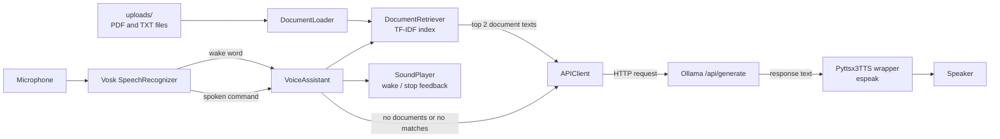
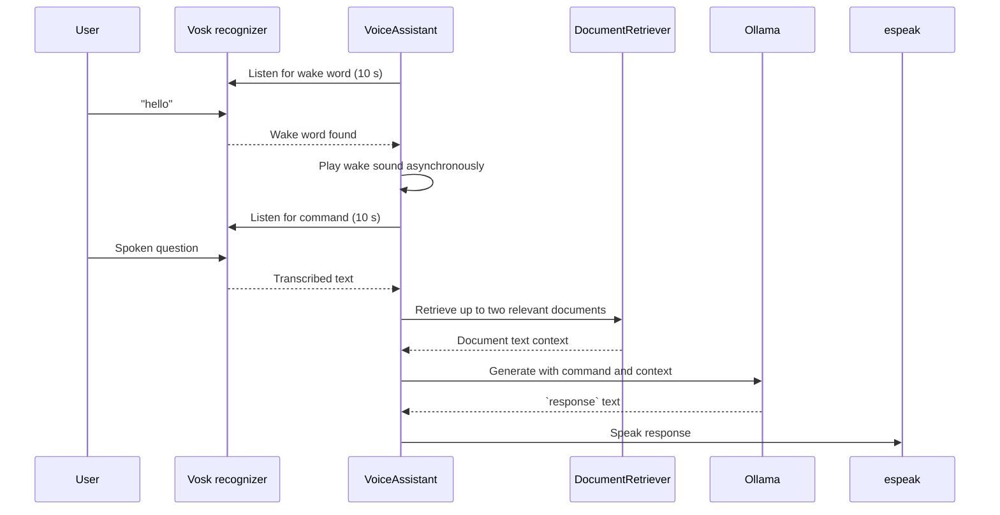

<p align="center">
  
</p>

# Helios AI - Local AI Framework for NVIDIA Jetson Nano and Solar-Powered Robots

Helios AI is a local AI framework centered on a hands-free voice assistant. It listens for a wake word, accepts a spoken question, and says an AI-generated answer aloud. It is intended for NVIDIA Jetson Nano deployments and solar-powered robot projects where a compact, voice-first local interface is useful. It can also use the contents of PDF and text files as context for its answers. Speech recognition runs locally with the bundled Vosk models, while the language model is served separately by Ollama.

Use Helios AI when typing is inconvenient, when you want to ask questions about a small collection of documents, or when you are building a voice interface for an edge device or robot. Its interesting characteristic is that microphone recognition, wake-word detection, sound feedback, and document lookup are all handled locally; only the configured Ollama service is asked to generate the answer. It is a developer-oriented foundation rather than a packaged end-user application.

> **Current scope:** the codebase implements the voice, document-retrieval, and local-LLM layer. Robot motor control, solar-panel monitoring, battery management, GPIO integration, and autonomous navigation are not implemented in the current codebase.

## Contents

- [What it does](#what-it-does)
- [Architecture and execution flow](#architecture-and-execution-flow)
- [Repository structure](#repository-structure)
- [Prerequisites](#prerequisites)
- [Install and run](#install-and-run)
- [Configuration](#configuration)
- [Using documents as context](#using-documents-as-context)
- [Components and APIs](#components-and-apis)
- [Development, quality checks, and logging](#development-quality-checks-and-logging)
- [Limitations and troubleshooting](#limitations-and-troubleshooting)
- [License](#license)

## What it does

At startup, Helios AI reads supported files from `uploads/`, then starts listening through the default microphone. The default wake word is `hello`. Once detected, Helios AI plays a wake sound and repeatedly accepts commands until it hears a phrase containing `stop` or the command-listening timeout expires. Each command is optionally matched to the two most relevant loaded documents, sent to Ollama, and spoken through `espeak`.

Implemented capabilities:

- Offline microphone transcription with Vosk and bundled small English and Italian models.
- A configurable wake word and command timeout.
- Local Ollama generation through `POST /api/generate` with `stream: false`.
- PDF text extraction via `pdfplumber` and UTF-8 `.txt` loading.
- TF-IDF plus cosine-similarity retrieval of the top two matching documents.
- Spoken replies via `espeak` and short feedback sounds via `pygame`.
- Separate configured model names for normal (`talk`) and keyword-selected (`think`/`ponder`) requests.
- A PocketSphinx recognizer implementation that can be selected by changing one import.

## Architecture and execution flow



The application is intentionally split by responsibility: `main.py` performs startup document loading, `VoiceAssistant` coordinates the conversation loop, and dedicated adapters isolate speech, audio, document, and HTTP concerns. This makes recognizer or synthesis implementations replaceable without changing orchestration logic.

### Command lifecycle



If a command contains `stop` (substring, case-insensitive), the assistant leaves command mode and returns to wake-word listening. If no final Vosk result arrives before the timeout, it plays `TIMEOUT_SOUND` and also returns to wake-word listening.

## Repository structure

```text
.
├── main.py                       Application entry point and document-loading process
├── assistant.py                  Conversation orchestration and command loop
├── config.py                     Runtime constants and language/model selection
├── requirements.txt              Python dependencies and platform-specific Vosk wheel URL
├── api/
│   └── api_client.py             Ollama HTTP client with retry behavior
├── audio/
│   ├── tts.py                    espeak-backed speech and optional gTTS file generator
│   └── sound_player.py           pygame sound-effect player
├── document/
│   ├── document_loader.py        PDF/TXT loading and PDF text extraction
│   └── document_retriever.py     TF-IDF/cosine-similarity document ranking
├── recognizer/
│   ├── speech_recognizer.py      Active Vosk/PyAudio recognizer
│   ├── speech_recognizer_pocketsphinx.py  Alternative PocketSphinx recognizer
│   └── models/                   Bundled Vosk and PocketSphinx speech models
├── sounds/                       Wake and stop MP3 feedback sounds
├── pictures/                     Helios AI logo and Emilia 5.9 deployment photograph
├── .github/workflows/pylint.yml  Push-triggered Pylint workflow
└── LICENSE                       MIT license
```

`uploads/` and `tts_audio/` are configuration defaults, not tracked directories. Create them when using document retrieval or `GttsTTS`.

## Prerequisites

- Python 3.8 or newer. The included CI workflow runs Pylint against Python 3.8–3.11; it does not run the application or tests.
- A working microphone and speaker/audio output.
- System `espeak` with the configured MBROLA voice available (default: `mb-us1`).
- A locally running [Ollama](https://ollama.com/) server reachable at the configured URL, with the configured model downloaded (default: `llama3.2:1b`).
- Platform-compatible audio and ML dependencies. `requirements.txt` includes a Linux ARM64 Vosk wheel and PyTorch CUDA 11.8 index, which aligns with the NVIDIA Jetson/Linux target. These entries may not install unchanged on Windows, macOS, non-ARM64 Linux, or a different CUDA version.

## Install and run

From the repository root, create and activate a virtual environment, then install dependencies.

```bash
python -m venv .venv
source .venv/bin/activate              # Linux/macOS
python -m pip install --upgrade pip
python -m pip install -r requirements.txt
```

In PowerShell, activate it with:

```powershell
.\.venv\Scripts\Activate.ps1
```

Before launching Helios AI, start Ollama and make the configured model available. For a default Ollama installation, that commonly means:

```bash
ollama serve
ollama pull llama3.2:1b
```

Create the optional document directory if you plan to provide files:

```bash
mkdir -p uploads
```

Then run the application:

```bash
python main.py
```

Expected startup behavior: debug-level logs appear in the terminal, Helios AI speaks a greeting, and it begins listening for `hello`. Say `hello`, wait for the feedback sound, ask a question, then say a phrase containing `stop` to end that command session.

> **Note:** There is no build step, command-line interface, web server, or packaging configuration in the current codebase.

## Configuration

All runtime settings are Python constants in [`config.py`](config.py); the code does not read a `.env` file or environment variables. Restart the program after changing them.

| Setting | Default | Effect |
|---|---|---|
| `LANGUAGE` | `"en"` | Selects the Vosk model and default MBROLA voice. Supported branches are `en` and `it`. |
| `VOICE` | `mb-us1` for English | `espeak -v` voice passed by `Pyttsx3TTS`. Set indirectly by the language branch, or override in `config.py`. |
| `WAKE_WORD` | `hello` | Word or substring that switches from idle to command mode. |
| `LISTEN_TIMEOUT` | `10` seconds | Maximum duration for each Vosk listening operation. |
| `WAKE_SOUND` | `sounds/wake_up.mp3` | Sound played after wake-word detection. |
| `STOP_SOUND` | `sounds/stop.mp3` | Sound played after a stop command. |
| `TIMEOUT_SOUND` | `sounds/stop.mp3` | Sound played after command-mode timeout. |
| `UPLOAD_FOLDER` | `uploads` | Directory scanned once at startup for documents. |
| `ALLOWED_EXTENSIONS` | `{'pdf', 'txt'}` | File types the document loader accepts. |
| `VOSK_MODEL_PATH` | language-dependent | Path provided to Vosk `Model`. |
| `OLLAMA_API_URL` | `http://localhost:11434/api/generate` | HTTP endpoint used for generation. |
| `MODEL_TALK` | `llama3.2:1b` | Model for ordinary commands. |
| `MODEL_THINK` | `llama3.2:1b` | Model when the command includes `think` or `ponder`. |

### Example: Italian voice recognition

Set the language and an Italian wake word in `config.py`:

```python
LANGUAGE = "it"
WAKE_WORD = "ciao"
```

The existing configuration then selects `recognizer/models/vosk-model-small-it-0.22` and `mb-it4`. Ensure that voice is installed in `espeak` on the host.

## Using documents as context

Place UTF-8 text files and text-based PDFs directly in `uploads/` before starting the program:

```text
uploads/
├── handbook.pdf
└── notes.txt
```

`main.py` starts a child process that calls `DocumentLoader.load_documents()`, waits for it to finish, and passes the loaded dictionary to `VoiceAssistant`. `DocumentRetriever` fits a `TfidfVectorizer` over the complete document texts. For every spoken command it calculates cosine similarity and adds the content of the highest-ranked two documents to the prompt:

```text
Context:
<entire text of retrieved document 1>
<entire text of retrieved document 2>

Prompt:
<spoken command>
```

This is simple retrieval augmentation, not a persistent vector database or a document upload service. Documents are not re-scanned while Helios AI is running. Scanned/image-only PDFs may load with empty text because OCR is not implemented.

## Components and APIs

| Component | Main API | Responsibility |
|---|---|---|
| `VoiceAssistant` | `run()`, `process_command()` | Owns the wake/command state loop, chooses talk/think mode, and sends responses to TTS. |
| `SpeechRecognizer` (Vosk) | `listen(timeout)`, `listen_for_wake_word(word)` | Captures 16 kHz mono PCM from PyAudio and concatenates final Vosk recognition results. |
| `APIClient` | `talk(message, context)`, `think(message, context)` | Formats a contextual prompt and posts `{model, prompt, stream: false}` to Ollama. `_send_request()` retries three times, waiting five seconds between attempts. |
| `DocumentLoader` | `load_documents()` | Lists the configured folder, extracts PDF pages with `pdfplumber`, and reads `.txt` files as UTF-8. |
| `DocumentRetriever` | `retrieve(query, top_k=2)` | Creates a TF-IDF document matrix once and returns highest cosine-similarity document tuples. |
| `Pyttsx3TTS` | `speak(text)` | Invokes `espeak` synchronously with voice, rate 120, and pitch 50. Despite its name, it does not call the imported `pyttsx3` library. |
| `GttsTTS` | `generate_audio(...)` | Optional, unused-by-default Google TTS MP3 generator. It saves under `TTS_FOLDER`. |
| `SoundPlayer` | `play_sound(path)` | Plays MP3 feedback via the process-global pygame mixer. `VoiceAssistant` runs this in a separate process. |

The alternative `recognizer/speech_recognizer_pocketsphinx.py` uses the bundled US-English PocketSphinx assets. It is not active by default and has a different timeout behavior: its `listen()` takes the first `LiveSpeech` result and does not enforce the passed timeout.

## Development, quality checks, and logging

The repository includes one GitHub Actions workflow, [`.github/workflows/pylint.yml`](.github/workflows/pylint.yml). It runs Pylint on every push across Ubuntu and Windows with Python 3.8–3.11. It installs Pylint only, then analyses all tracked Python files.

There are no unit tests, integration tests, test commands, formatter configuration, or test fixtures in the current codebase. A useful local static check is:

```bash
python -m pip install pylint
pylint $(git ls-files '*.py')
```

`main.py` sets logging to `DEBUG`, so startup, recognized text, retrieval choices, Ollama request/response metadata, and recoverable errors are written to standard output. The API client logs the first 50 characters of the prompt and the full raw HTTP response at debug level; treat console logs accordingly if prompts may contain sensitive document content.

## Limitations and troubleshooting

| Symptom | Likely cause and action |
|---|---|
| Vosk fails while starting | Verify `VOSK_MODEL_PATH` exists and matches `LANGUAGE`. The required English and Italian model folders are included under `recognizer/models/`. |
| `espeak` or voice errors | Install `espeak` and the selected MBROLA voice, or change `VOICE` to one installed on the system. |
| No response after a command | Confirm Ollama is running at `OLLAMA_API_URL` and the selected model has been pulled. Requests use a 150-second timeout and are retried up to three times. |
| Dependency installation fails | Review the platform-specific Vosk ARM64 wheel and CUDA 11.8 PyTorch index in `requirements.txt`; choose compatible packages for the host if it is not the intended NVIDIA Jetson/Linux target. |
| No documents are used | Create `uploads/`, put supported files directly inside it, and restart. The loader does not create the directory and does not recurse into subdirectories. |
| Stop detection triggers unexpectedly | The application checks whether `stop` occurs anywhere in the recognized text, not as an exact command. Change this check in `assistant.py` if needed. |
| Speech is missing or incomplete | The Vosk recognizer only appends final recognition results; partial results are not returned. Adjust the recognizer if live partial transcription is required. |

Additional production-grade capabilities—authentication, persistence, OCR, streaming, graceful shutdown, device selection, a formal command grammar, test coverage, and configurable settings through environment variables—are not implemented. Hardware compatibility and a supported deployment target could not be determined from the current codebase.

## Origins and field deployment

Helios AI was started through a collaboration with [Onda Solare](https://ondasolare.com/), the Italian solar-vehicle team. The system has been installed on **Emilia 5.9**, Onda Solare’s solar car, and accompanied the team at the **2025 Bridgestone World Solar Challenge** in Australia.

<p align="center">
  
</p>

Watch the Teaser trailer : [Surfin’ the wave - Emilia 5.9](https://www.youtube.com/watch?v=8vY06AmO5Fg).

## License

Helios AI is licensed under the [MIT License](LICENSE). The repository also contains third-party Vosk and PocketSphinx speech-model assets with their own included notices; review the README/license material inside `recognizer/models/` before redistribution.
