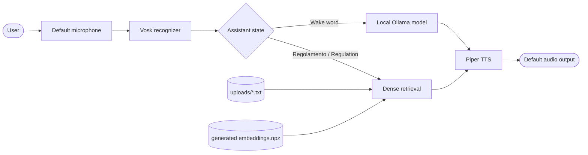

<p align="center">
  
</p>

# Helios AI

Helios AI is a local-first voice assistant for NVIDIA Jetson and desktop
development. It combines offline speech recognition, an Ollama-hosted language
model, local Piper speech synthesis, and integrity-checked semantic retrieval.
The default Italian profile was built for Onda Solare's Emilia 5.9 solar
vehicle.

The project is a voice and retrieval framework. It does not control vehicle
hardware, navigation, telemetry, batteries, or GPIO.

## How it works



The runtime has two states:

- In command mode, a finalized utterance containing `emilia`, `amelia`, or
  `hello` is sent to Ollama. A few presentation questions use predefined local
  answers.
- Saying `regolamento` in Italian or `regulation` in English enters RAG mode.
  The next finalized utterance is searched against the local corpus, spoken,
  and the assistant returns to command mode.

Recognition returns as soon as Vosk finalizes a phrase. The configured
`listen_timeout` is an upper bound, not a mandatory fixed delay.

## Architecture

The active runtime is deliberately small:

| Component | Responsibility |
| --- | --- |
| `main.py` | Configure logging and own the application lifecycle |
| `assistant.py` | Coordinate command/RAG state and injected services |
| `config.py` | Validate settings, language profiles, and rooted paths |
| `recognizer/speech_recognizer.py` | Capture audio and expose final/partial Vosk events |
| `api/api_client.py` | Normalize the Ollama host, stream responses, and retry failures |
| `audio/tts.py` | Lazily load one Piper voice and play in-memory PCM frames |
| `audio/sound_player.py` | Lazily invoke `aplay` for short state cues |
| `document/rag_system.py` | Build, validate, cache, and search the dense index |

Production adapters are created by `VoiceAssistant`, but every expensive or
hardware-facing boundary can be injected. Unit tests therefore run without a
microphone, Ollama, Piper, Vosk, Torch, or the bundled models.

Resources have explicit lifecycles:

- microphone streams are stopped and closed in `finally` blocks;
- owned PyAudio instances are terminated on shutdown;
- the assistant shares one Piper instance with the Ollama client;
- notification sounds use one bounded worker instead of a process per cue;
- assistant shutdown is idempotent.

## Repository layout

```text
.
|-- api/                       Ollama client and local Modelfiles
|-- audio/                     Piper and notification-sound adapters
|   `-- models/                Bundled Italian and English Piper voices
|-- document/                  Integrity-checked dense retrieval
|-- models/                    Bundled SentenceTransformer model
|-- recognizer/                Vosk adapter and bundled language models
|-- scripts/
|   |-- build_index.py         Explicit RAG index builder
|   |-- doctor.py              Environment and asset validator
|   `-- smoke_tts.py           Manual TTS hardware smoke check
|-- sounds/                    WAV state cues
|-- tests/                     Model-free unit tests
|-- uploads/                   Text corpus used by RAG
|-- assets-manifest.json       Asset inventory and checksums
|-- requirements-runtime.txt  Shared platform-neutral dependencies
|-- requirements.txt          Desktop dependency entry point
|-- requirements-jetson.txt   Jetson deployment contract
|-- requirements-dev.txt      Model-free development tools
|-- assistant.py
|-- config.py
`-- main.py
```

Helios currently runs from a source checkout. The bundled models, sounds, and
corpus are not packaged into a Python wheel, and `pyproject.toml` intentionally
defines tooling rather than an installable console command.

## Requirements

- Python 3.10 or newer
- Ollama and the configured local model tags
- PortAudio/PyAudio and a working default microphone
- a working default audio output for `sounddevice`
- ALSA `aplay` on the Jetson/Linux target for notification cues
- enough storage and memory for the bundled models and the selected Ollama model

### Desktop development

Create and activate a virtual environment, then install:

```bash
python -m pip install -r requirements.txt
```

This installs portable runtime dependencies plus desktop CPU backends. PyAudio
may require PortAudio development packages on Linux.

### Jetson

PyTorch and ONNX Runtime must match the exact JetPack/L4T image. Install
NVIDIA's supported builds first. The known Helios target also uses the
Jetson-compatible `piper-phonemize-fix`; install Piper without dependency
resolution so it cannot replace that phonemizer or the vendor ONNX backend:

```bash
python -c "import torch, onnxruntime; print(torch.__version__, onnxruntime.__version__)"
python -m pip install piper-phonemize-fix==1.2.1
python -m pip install --no-deps piper-tts==1.2.0
python -m pip install -r requirements-jetson.txt
python -c "import piper, torch, onnxruntime; print('Jetson backends import successfully')"
```

`requirements-jetson.txt` intentionally contains no guessed vendor wheel URL.
An incompatible generic wheel can replace an accelerated backend or fail on
AArch64. Revalidate the pinned Piper/phonemizer pair whenever the JetPack image
changes.

### Ollama models

Start Ollama and create the local model tags referenced by the language
profiles:

```bash
ollama create emilia-gemma3:1b -f api/Modelfile-IT
ollama create emilia-en-gemma3:1b -f api/Modelfile-EN
ollama pull qwen3:0.6b
```

Check the available tags with:

```bash
ollama list
```

## Configuration

New code should use `config.SETTINGS`, an immutable `Settings` instance. The
historical module constants remain as compatibility aliases.

Two deployment overrides are supported without editing source:

```bash
# Linux/macOS
export HELIOS_LANGUAGE=it
export HELIOS_OLLAMA_HOST=http://localhost:11434
```

```powershell
# PowerShell
$env:HELIOS_LANGUAGE = "it"
$env:HELIOS_OLLAMA_HOST = "http://localhost:11434"
```

Supported languages are `it` and `en`. Invalid values fail during configuration
instead of silently selecting a partial profile. URLs ending in legacy Ollama
paths such as `/api/generate` are normalized to the SDK host.

Important settings include:

| Setting | Default | Meaning |
| --- | --- | --- |
| `language` | `it` | Language/model profile |
| `listen_timeout` | `6.5` seconds | Maximum recognition window |
| `ollama_host` | `http://localhost:11434` | Ollama SDK base host |
| `top_k` | `4` | Number of RAG passages returned |
| `log_file_name` | `app.log` | Append-only application log |

All model, corpus, sound, index, and log paths are derived from
`Settings.project_root`, so launching from another current directory does not
redirect runtime files.

## RAG index lifecycle

`uploads/*.txt` is the source of truth. Files are sorted deterministically and
split into source-aware sentence chunks. `embeddings.npz` is generated output
and is intentionally ignored by Git.

Build it explicitly before deployment:

```bash
python scripts/build_index.py
```

Useful overrides:

```bash
python scripts/build_index.py \
  --corpus uploads \
  --model models/all-MiniLM-L6-v2 \
  --output embeddings.npz \
  --batch-size 16 \
  --device cpu
```

If no index exists, the first RAG request builds one. Prebuilding is preferred
on constrained devices because model loading and corpus encoding add latency.

Every index contains a schema manifest binding the matrix to:

- deterministic chunk order and corpus SHA-256;
- embedding-model content identity;
- splitter version;
- row count and vector dimension;
- dtype and normalized-vector contract;
- embedding-matrix SHA-256.

The runtime rejects legacy, corrupt, non-finite, non-normalized, stale, or
wrong-model indexes with a rebuild instruction. It never silently pairs a text
chunk with an unrelated vector. Valid corpus and vectors are cached after the
first query.

`RagSystem.retrieve()` returns structured passages with source and score.
`RagSystem.run()` retains the historical semicolon-joined string result.

## Validate a checkout

The doctor does not load models or open audio devices:

```bash
python scripts/doctor.py --assets-only --check-hashes
```

To also verify installed runtime modules:

```bash
python scripts/doctor.py
```

Asset-license warnings are release gates to investigate; they are not hash
failures. See [THIRD_PARTY_NOTICES.md](THIRD_PARTY_NOTICES.md) and
`assets-manifest.json`.

## Run

From the repository root:

```bash
python main.py
```

The assistant appends operational logs to `app.log`. It does not truncate logs
or globally disable library logging.

Manual TTS hardware check:

```bash
python scripts/smoke_tts.py
python scripts/smoke_tts.py "Test phrase"
```

Press `Ctrl+C` to stop the assistant. The normal shutdown path releases audio
and worker resources.

## Development and tests

Install only the model-free development dependencies:

```bash
python -m pip install -r requirements-dev.txt
```

Run the same checks as CI:

```bash
python -m ruff check .
python -m ruff format --check .
python -m compileall -q main.py assistant.py config.py api audio document recognizer scripts tests
python -m pytest
python scripts/doctor.py --assets-only --check-hashes
```

The unit suite covers:

- command and RAG state transitions;
- whole-word wake detection and finalized-recognition routing;
- configured `top_k` and deterministic cleanup;
- Ollama host normalization, streaming, completion fields, and retries;
- in-memory WAV frame handling and lazy sound capability checks;
- Vosk event contracts and stream/PyAudio cleanup;
- RAG row/corpus/model/checksum integrity, normalization, caching, and ranking;
- asset inventory path, hash, and optional-artifact behavior.

GitHub Actions runs model-free checks on Ubuntu and Windows with Python 3.10 and
3.12. Hardware validation remains a separate target-device step.

## Performance notes

Confirmed optimizations in the current runtime:

- the RAG corpus and compressed matrix are loaded once per process;
- each query is encoded once;
- no redundant warm-up query runs at assistant startup;
- the Ollama client, Vosk model, and RAG encoder are lazy;
- Piper synthesis uses an in-memory WAV buffer and plays only PCM frames;
- notification cues reuse a single worker.

The corpus currently has roughly one thousand chunks, so deterministic full
ranking is simpler and fast enough. An ANN index is not justified without
measurements at a materially larger corpus size.

Jetson CPU/GPU placement, embedding batch size, and audio/LLM overlap should be
selected from target-device profiles. The repository does not claim a
speculative hardware speedup.

## Known limitations

- Only `.txt` corpus ingestion is active; PDF ingestion is not implemented.
- The default microphone and output device are selected by their libraries;
  there is no device-selection CLI yet.
- Notification cues require `aplay`; missing cues are logged without taking
  down the main assistant loop.
- The first RAG build is expensive enough that production images should
  precompute it.
- Retrieval relevance still needs a small language-specific gold-question set
  before changing the embedding model or splitter.
- CI validates logic without loading the bundled neural models or using audio
  hardware.
- Existing large model history has not been rewritten into Git LFS. New
  migration work requires a deliberate repository-history operation.
- Several bundled voices, corpora, sounds, and images still lack complete
  upstream provenance or redistribution records.

## Troubleshooting

### Ollama cannot be reached

Confirm `ollama serve` is running, `HELIOS_OLLAMA_HOST` points to the SDK base
host, and the configured tags appear in `ollama list`. API failures are retried
and then raised as `APIClientError`.

### The RAG index is rejected

Delete only the generated `embeddings.npz` and run:

```bash
python scripts/build_index.py
```

Do not copy an index between different corpora or embedding models.

### No microphone input

Run `python scripts/doctor.py`, verify PortAudio/PyAudio, and confirm that the
process can access the default input device. Recognition failures are recorded
in `app.log`.

### Speech works but cues do not

Install ALSA utilities and verify:

```bash
aplay sounds/wake_up.wav
```

### Asset validation reports warnings

Read [THIRD_PARTY_NOTICES.md](THIRD_PARTY_NOTICES.md). Hash mismatches are
errors; missing source/license metadata is surfaced as a warning until release
provenance is completed.

## License

Project source is provided under [LICENSE](LICENSE). Bundled third-party models
and content retain their own terms; the project license does not relicense
them.
